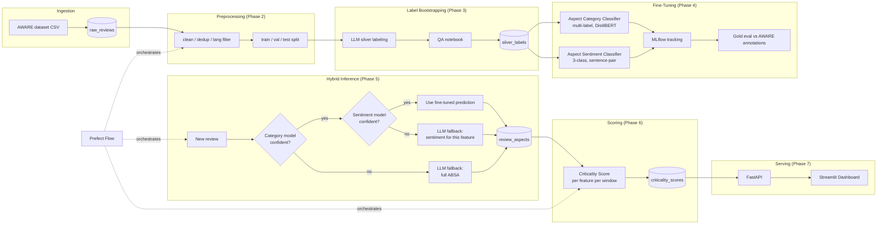

# FixFirst AI

**Automated Feature Prioritization Engine for Developers**

FixFirst AI turns thousands of unstructured app/software reviews into a ranked, feature-level engineering backlog — replacing a vague 3.5-star rating with something a developer can act on: *"Fix Login Crash — 84% negative sentiment across 400 reviews."*

It does this with **Aspect-Based Sentiment Analysis (ABSA)**: instead of scoring a whole review as positive or negative, it identifies *which* product feature is being discussed (login, sync, offline mode, billing...) and *how the user feels about that specific feature* — so "auth is broken, sync speed is fine" becomes two separate, actionable signals instead of one blended star rating.

---

## Why this project

Most sentiment tooling stops at whole-document polarity. That's fine for a marketing dashboard; it's useless for a sprint planning meeting, because it can't tell you *what* to fix. FixFirst AI is built around a genuine engineering tradeoff: a fine-tuned transformer classifier is cheap and fast but limited to what it's been trained on, while an LLM is flexible and can zero-shot new categories but is slower and more expensive per call. Rather than picking one, this project routes between them at inference time based on model confidence — the fine-tuned model handles the majority of traffic, and the LLM is called only when the fine-tuned model is genuinely unsure. That routing decision, and the fallback rate it produces, is the core engineering story of this project.

---

## Architecture



---

## Tech stack

| Layer | Choice |
|---|---|
| Database | PostgreSQL (Docker), SQLAlchemy ORM |
| Experiment tracking | MLflow (Postgres backend store) |
| Orchestration | Prefect 2 |
| Fine-tuned models | DistilBERT (swappable to DeBERTa-v3), HuggingFace `transformers` |
| LLM fallback | Anthropic Claude (provider-agnostic: OpenAI/Groq also supported) |
| Serving | FastAPI |
| Dashboard | Streamlit + Plotly |
| Containerization | Docker Compose (Postgres, MLflow, API, Dashboard) |

---

## The hybrid ABSA pipeline

1. **Aspect Category Classifier** (multi-label) — decides *which* features a review discusses, out of a curated taxonomy in `features_master`.
2. **Aspect Sentiment Classifier** (3-class, sentence-pair) — given `(review, feature)`, decides the sentiment toward that specific feature.
3. **Confidence-gated routing** — both models output calibrated confidence. Below a configurable threshold (`LLM_FALLBACK_THRESHOLD`, default `0.65`), the decision is deferred to an LLM instead of trusting an uncertain prediction:
   - Category-uncertain → the whole review is re-analyzed by the LLM (one call gets both aspects and sentiment).
   - Sentiment-uncertain (category was confident) → the LLM re-analyzes the review; if it corroborates the feature, its sentiment is used; if it doesn't, the fine-tuned prediction is retained rather than discarded.
4. Every prediction is tagged `source: finetuned | llm_fallback` in `review_aspects`, which is what makes the fallback rate measurable rather than anecdotal.

**Fallback rate:** *TBD — run `scripts/run_hybrid_inference.py` and report `fallback_stats` here, e.g. "12% of inferences required LLM fallback, concentrated in 3 rare feature categories."*

---

## Criticality Score

```
score = negative_ratio × log(1 + mention_count) × mean(recency_weight)
```

- **`negative_ratio`** — the core severity signal: what fraction of mentions are negative.
- **`log(1 + mention_count)`** — frequency, log-dampened so raw volume doesn't linearly dominate.
- **`recency_weight`** — exponential decay per review (`0.5 ^ (age_days / 90)` by default), so a feature that *used* to be broken but was fixed 6 months ago scores lower than one that's actively bad. Reviews with no date (e.g. AWARE, which is undated) get weight `1.0` rather than being penalized for missing metadata — this is logged via an `undated_ratio` field so it's visible, not hidden.

**Known simplification:** an earlier design included a `severity_weight` term (crash > "could be better"). That requires an intensity signal this project doesn't currently produce — the 3-class sentiment scheme has no severity dimension. It's a documented extension point, not a silently dropped promise.

---

## Repository structure

```
fixfirst-ai/
├── Makefile                    # make help — wraps every command below
├── docker-compose.yml          # Postgres + MLflow + API + Dashboard
├── docker/                     # Dockerfiles for mlflow / api / dashboard
├── requirements.txt            # Serving/pipeline dependencies (no torch)
├── requirements-training.txt   # torch + transformers, training-only
├── scripts/                    # CLI entrypoints for every pipeline stage
├── src/fixfirst/
│   ├── config/                 # Settings (.env-driven)
│   ├── db/                     # SQLAlchemy models + session mgmt
│   ├── ingestion/               # AWARE dataset loader
│   ├── preprocessing/          # Clean, dedup, language filter, split
│   ├── labeling/                # LLM silver-labeling (Phase 3)
│   ├── models/                  # Fine-tuned classifier training (Phase 4)
│   ├── evaluation/               # Gold-label eval vs AWARE annotations
│   ├── inference/                # Hybrid confidence-gated routing (Phase 5)
│   ├── scoring/                  # Criticality score computation (Phase 6)
│   ├── orchestration/            # Prefect flow
│   ├── api/                      # FastAPI serving layer
│   └── dashboard/                # Streamlit frontend
├── notebooks/                   # Silver-label QA notebook
└── data/                        # raw / processed / silver_labels / gold_eval
```

---

## Setup & running the full pipeline

A `Makefile` wraps every command below — run `make help` at any point to see the full list. Raw commands are also given for anyone who prefers to run them directly or is on a system without `make`.

### 1. Environment
```bash
make env
# then fill in ANTHROPIC_API_KEY (or OPENAI_API_KEY / GROQ_API_KEY + LLM_PROVIDER) in .env
```
<sub>Raw: `cp .env.example .env`</sub>

### 2. Start infrastructure
```bash
make up
```
<sub>Raw: `docker compose up -d db mlflow`</sub>

### 3. Bootstrap the database
```bash
make init-db
make seed-features
# or both, plus step 2, in one go:
make bootstrap
```
<sub>Raw: `PYTHONPATH=src python scripts/init_db.py` then `scripts/seed_features.py`</sub>

### 4. Ingest data
Download the [AWARE dataset](https://github.com) and verify its column names against `AWARE_COLUMN_MAP` in `src/fixfirst/ingestion/aware_loader.py` before running:
```bash
make ingest CSV=data/raw/aware_reviews.csv
```
<sub>Raw: `PYTHONPATH=src python scripts/ingest_aware.py --csv data/raw/aware_reviews.csv`</sub>

### 5. Preprocess
```bash
make preprocess
```
<sub>Raw: `PYTHONPATH=src python scripts/run_preprocessing.py`</sub>

### 6. Bootstrap silver labels with zero-shot classification
```bash
make install-training   # needed for torch + transformers
make label LIMIT=10   # sanity check first
make label BATCH_SIZE=8   # full run
```
Then inspect `notebooks/03_silver_label_qa.ipynb` before trusting the labels.
<sub>Raw: `PYTHONPATH=src python scripts/run_silver_labeling.py [--limit 10] [--batch-size 8] [--no-resume]`</sub>

### 7. Train the fine-tuned models
```bash
make install-training
make train              # both classifiers
# or individually, with a smoke-test limit:
make train-category LIMIT=50
make train-sentiment
```
<sub>Raw: `pip install -r requirements-training.txt --break-system-packages` then `PYTHONPATH=src python scripts/train_aspect_category.py` / `train_aspect_sentiment.py`</sub>

### 8. Evaluate against AWARE gold labels
Verify `AWARE_CATEGORY_MAP` in `src/fixfirst/evaluation/category_mapping.py` against your actual AWARE category values first.
```bash
make eval
```
<sub>Raw: `PYTHONPATH=src python scripts/run_gold_eval.py`</sub>

### 9. Run hybrid inference + scoring
```bash
make infer               # SPLIT=test by default; try SPLIT=val or SPLIT=train
make score                # HALF_LIFE=90 by default
```
<sub>Raw: `PYTHONPATH=src python scripts/run_hybrid_inference.py --split test` then `scripts/run_scoring.py`</sub>

### 10. Bring up the full stack
```bash
make up-all
```
<sub>Raw: `docker compose up --build`</sub>

- API: `http://localhost:8000/docs`
- Dashboard: `http://localhost:8501`

### Or run everything via Prefect
```bash
make pipeline-bootstrap CSV=data/raw/aware_reviews.csv   # first run, includes ingestion
make pipeline                                             # subsequent runs
```
<sub>Raw: `PYTHONPATH=src python scripts/run_pipeline_flow.py --run-ingestion --aware-csv data/raw/aware_reviews.csv`</sub>

---

## Evaluation results

*TBD — populate after running `scripts/run_gold_eval.py` on the real AWARE dataset:*

| Model | Metric | Value |
|---|---|---|
| Aspect Category (multi-label) | F1 (micro) | — |
| Aspect Category (multi-label) | F1 (macro) | — |
| Aspect Sentiment (3-class) | Accuracy | — |
| Aspect Sentiment (3-class) | F1 (macro) | — |
| Hybrid pipeline | LLM fallback rate | — |

---

## Known limitations

- **AWARE category mapping is a starting point, not verified against the real dataset.** `AWARE_CATEGORY_MAP` in `evaluation/category_mapping.py` needs to be checked against the actual distinct `aspect_category` values in your downloaded file — an incomplete mapping silently shrinks the gold eval set rather than crashing (check the `report_mapping_coverage` log line).
- **No severity/intensity signal.** The criticality score uses `negative_ratio`, not a severity-weighted signal (see above).
- **Trend analysis requires dated reviews.** AWARE itself carries no review dates, so its data contributes to criticality scores but not to trend charts — trend analysis becomes meaningful once a dated source (Google Play scrape, App Store) is added.
- **Single-language.** The pipeline filters to English only (`preprocessing/language_filter.py`); multilingual support is a natural extension.

## Roadmap

- Google Play / App Store scraper as a second ingestion source, unlocking real trend analysis
- Active learning loop: developer corrections on the dashboard feed back into a retraining queue
- RAG-style evidence retrieval: click a criticality score to see representative review snippets via embedding similarity
- Swap DistilBERT → DeBERTa-v3 for higher accuracy once the pipeline is validated end-to-end